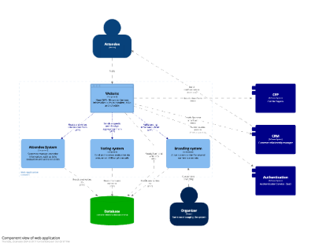
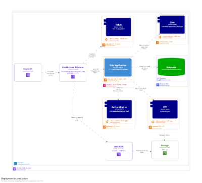

# Talent Arena - System Design

System design for a livestream platform

### System Landscape


### Deployment view


## How to run this example

Execute this command to run a Docker container with a structurizr lite image.

```bash
docker run --name livestream-architecture --env=PORT=8080 --volume=$(pwd)/workspace:/usr/local/structurizr -p 8888:8080 -d structurizr/lite:latest
```

## Links

* [Documentation](http://localhost:8888/workspace/documentation)
* [ADRs](http://localhost:8888/workspace/decisions)
* [Diagrams](http://localhost:8888/workspace/explore)